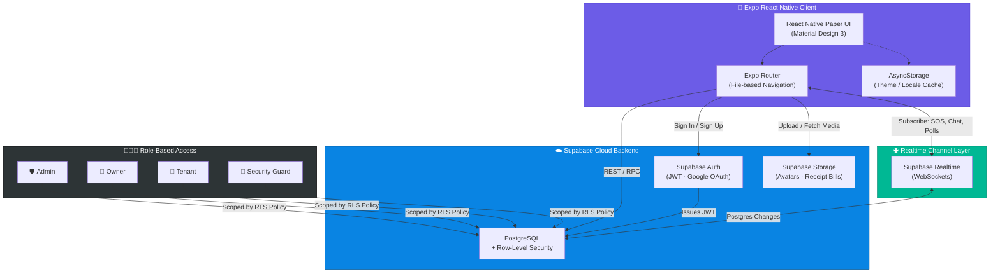
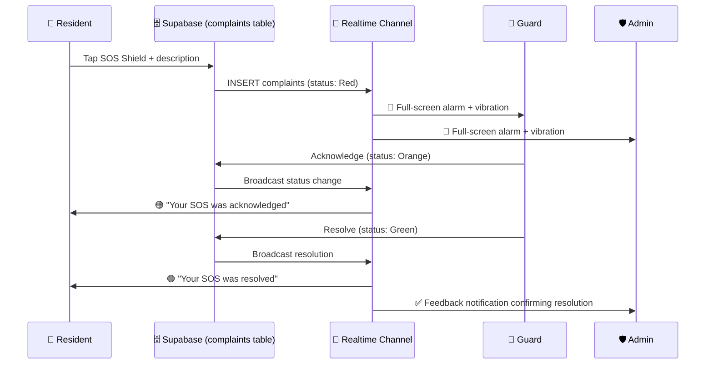
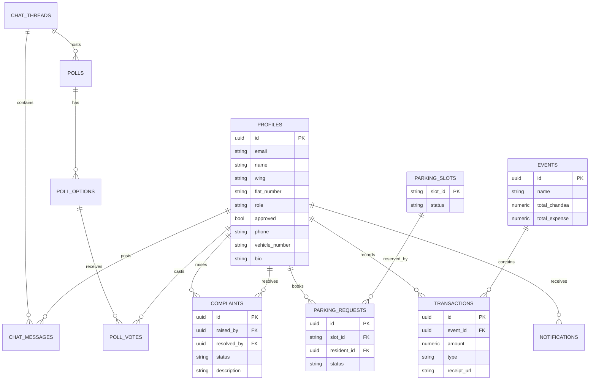

<div align="center">

# 🏢 SocietySync

### The Digital Nervous System for Modern Residential Societies

**Communication · Maintenance · Parking · Emergencies · Finance — Unified.**

<br/>


<br/>

```
╔══════════════════════════════════════════════════════════╗
║   🚨 SOS Alerts   💰 Ledgers   🚗 Parking   💬 Voting    ║
╚══════════════════════════════════════════════════════════╝
```

</div>

<br/>

> **SocietySync** consolidates every fragmented, paper-based, and chat-group-scattered process of running a residential society into **one secure, real-time mobile app** — with strict role-based access for Admins, Owners, Tenants, and Security Guards.

<br/>

---

## ✨ Why SocietySync?

<table>
<tr>
<td width="50%" valign="top">

### 😩 Before
- 📋 Maintenance dues tracked on paper ledgers
- 📱 Society updates lost in WhatsApp chaos
- 🚗 Visitor parking = first-come, double-booked chaos
- 🆘 Emergencies reported via phone calls that go unanswered
- 💸 Festival fund collections with zero transparency

</td>
<td width="50%" valign="top">

### 🚀 After SocietySync
- ✅ Real-time maintenance tracker with payment status
- ✅ Structured, threaded society discussions & live polls
- ✅ Slot-based parking booking with admin approval
- ✅ One-tap SOS Shield with instant guard/admin alarm
- ✅ Fully auditable festival income & expense ledgers

</td>
</tr>
</table>

<br/>

## 🎬 App in Motion

<div align="center">

| 🚨 Emergency SOS Shield | 💬 Live Council Chat & Polls | 🚗 Smart Parking Grid |
|:---:|:---:|:---:|
| Full-screen red alert, persistent vibration, real-time acknowledge → resolve workflow | Threaded discussions with Supabase Realtime-powered live vote counting | Visual V1–V10 slot grid that updates instantly as bookings are approved |

</div>

> 💡 *Tip for repo maintainers: drop your screen-recording GIFs into `/assets/demo/` and reference them here, e.g.*
> `` — animated GIFs render natively on GitHub and are the fastest way to show off Realtime features in action.

<br/>

## 🏗️ System Architecture

SocietySync follows a **thin-client, Realtime-first** architecture — the mobile app is purely presentational, while Supabase handles auth, data, storage, and live sync, all locked down with Postgres Row-Level Security.



<br/>

### 🔄 Real-Time SOS Alert Flow



<br/>

## 🧱 Tech Stack

<div align="center">

### 📱 Frontend


| Layer | Technology | Purpose |
|:---|:---|:---|
| **Framework** | `Expo (React Native) SDK 54` | Single codebase → native iOS & Android |
| **Navigation** | `Expo Router` | File-based routing for stacks, tabs & nested screens |
| **UI Library** | `React Native Paper (MD3)` | Cards, dialogs, snackbars, portals — Material Design 3 |
| **Icons** | `@expo/vector-icons` | Material Community Icons |
| **Local Storage** | `AsyncStorage` | Persists theme & language preferences |
| **Layout Safety** | `react-native-safe-area-context` | Notch / punch-hole / status-bar aware spacing |

### ☁️ Backend


| Layer | Technology | Purpose |
|:---|:---|:---|
| **Database** | `PostgreSQL` (Supabase) | Enterprise-grade relational storage |
| **Auth** | `Supabase Auth` | JWT sessions, Google Sign-In, password recovery |
| **Realtime** | `Supabase Realtime (WebSockets)` | Live chat, poll updates, SOS alarms |
| **Storage** | `Supabase Storage Buckets` | Avatars & transaction receipt bills |
| **Security** | `Postgres Row-Level Security (RLS)` | Per-role, per-user data access policies |

</div>

<br/>

## 🧩 Core Modules

<table>
<tr>
<td width="20%" align="center">🚨<br/><b>Emergency<br/>SOS Shield</b></td>
<td>One-tap crisis alert that triggers a persistent full-screen alarm for Admins & Guards, with an Acknowledge → Resolve workflow and automatic resident + admin feedback loops.</td>
</tr>
<tr>
<td width="20%" align="center">💰<br/><b>Festival Ledgers<br/>& Maintenance</b></td>
<td>Transparent festival fund tracking (Chandaa, Expenses, Balance) with receipt uploads, plus a monthly maintenance dues tracker (Pending / Paid / Partial / Overdue).</td>
</tr>
<tr>
<td width="20%" align="center">🚗<br/><b>Smart Visitor<br/>Parking</b></td>
<td>Live V1–V10 slot grid by date & time-block, an admin approval queue, and a guard-facing Gate Entry Checklist that auto-populates on approval.</td>
</tr>
<tr>
<td width="20%" align="center">💬<br/><b>Council Chats<br/>& Live Polls</b></td>
<td>Category-threaded discussions (#General, #Water-Infra, #Budget) plus Realtime voting polls with results updating live across every screen.</td>
</tr>
<tr>
<td width="20%" align="center">👤<br/><b>Profile &<br/>Roster</b></td>
<td>Wing/flat-organized resident directory, role cycling for admins, Dark/Light/System theming, and a diagnostics panel for connectivity health.</td>
</tr>
</table>

<br/>

## 🔐 Role-Based Access Control (RBAC)

<div align="center">

| Feature / Permission | 🛡️ Admin | 🏡 Owner | 👥 Tenant | 👮 Guard |
|:---|:---:|:---:|:---:|:---:|
| Manage Roster (Approve/Reject) | ✅ | ❌ | ❌ | ❌ |
| Cycle User Roles | ✅ | ❌ | ❌ | ❌ |
| Acknowledge & Resolve SOS | ✅ | ❌ | ❌ | ✅ |
| Record Festival Income/Expense | ✅ | ❌ | ❌ | ❌ |
| Approve/Reject Parking | ✅ | ❌ | ❌ | ❌ |
| Gate Entry Checklist | ❌ | ❌ | ❌ | ✅ |
| Create Voting Polls | ✅ | ❌ | ❌ | ❌ |
| Cast Votes | ✅ | ✅ | ✅ | ❌ |
| Post Chat Messages | ✅ | ✅ | ✅ | ❌ |

</div>

<br/>

## 🗄️ Database Schema



> 🔐 **Row-Level Security is enforced on every table.** Profiles are publicly readable (for the roster) but only self-or-admin editable. SOS complaints can be inserted by any approved resident but only updated by Guards/Admins. Notifications are strictly scoped to `auth.uid() = user_id`.

<br/>

## 🎨 UI/UX Principles

- **🧭 Safe-Area Aware** — `useSafeAreaInsets` keeps headers clear of notches & punch-holes on every device.
- **📐 Clearance Spacing** — 80–100px bottom padding keeps content clear of the floating tab bar.
- **🌗 Theme-Aware Contrast** — colors bind to `theme.colors.onSurface` / `theme.colors.surface`, never hardcoded — full Dark & Light mode support.
- **🏷️ Smart Contrast Badging** — role badges auto-adjust shade per theme (e.g. `#047857` for Owners in Light Mode) to stay readable.

<br/>

## 📂 Project Structure

```
societysync/
├── app/                      # Expo Router screens (file-based routing)
│   ├── (auth)/                 # Sign in / sign up / password recovery
│   ├── (tabs)/                  # Home, Parking, Chat, Profile tabs
│   └── (admin)/                 # Admin-only approval & roster screens
├── components/                # Reusable RN Paper UI components
├── lib/
│   ├── supabase.ts              # Supabase client init
│   └── realtime/                # Realtime channel subscriptions
├── assets/
│   └── demo/                    # 🎬 Drop your demo GIFs here
└── supabase/
    ├── migrations/               # SQL schema & RLS policies
    └── seed.sql
```

<br/>

## 🚀 Getting Started

```bash
# 1. Clone the repository
git clone https://github.com/<your-org>/societysync.git
cd societysync

# 2. Install dependencies
npm install

# 3. Configure environment variables
cp .env.example .env
# Add your Supabase URL & anon key

# 4. Run database migrations
npx supabase db push

# 5. Start the app
npx expo start
```

<br/>

<div align="center">

### 🌟 Built for societies that deserve better than spreadsheets and WhatsApp groups.

<br/>

**Made with ❤️ using Expo, React Native & Supabase**

</div>
