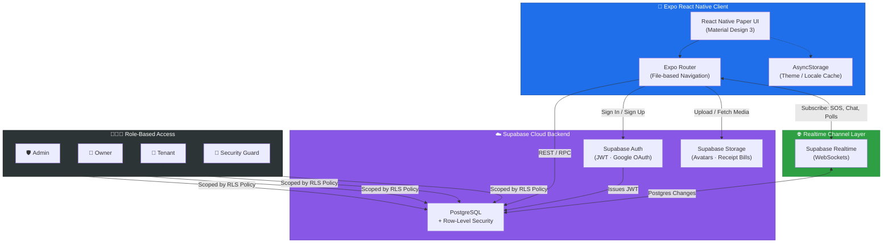
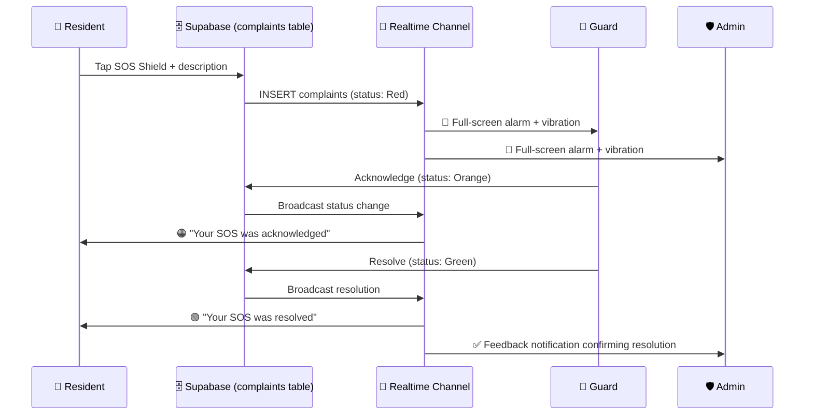
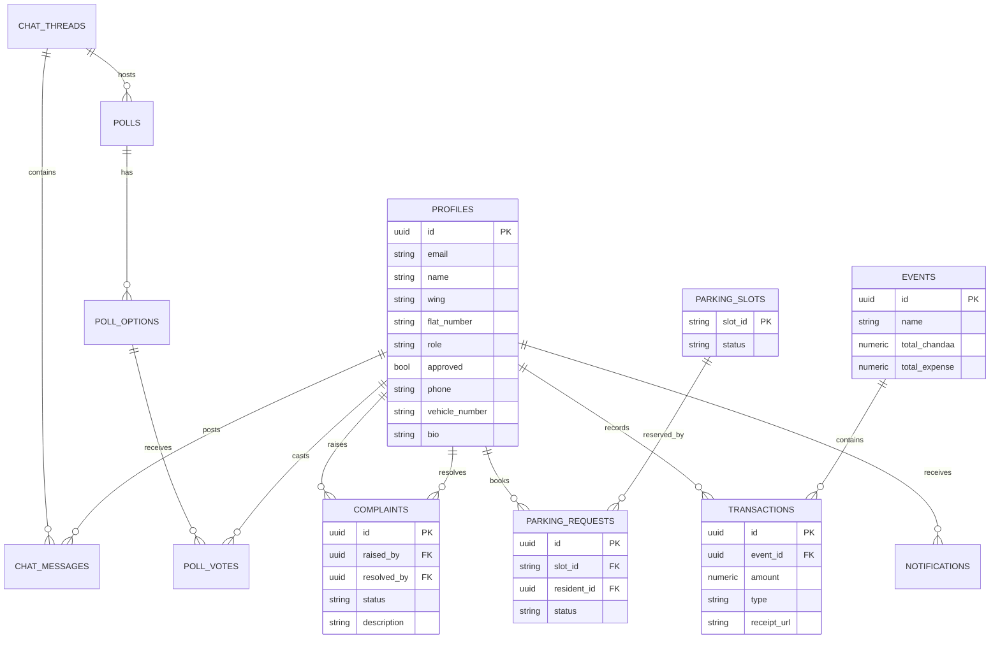

<div align="center">


<br/>

[](https://supabase.com)
[](#-license)
[](#)

<br/>

[](https://github.com/your-org/societysync)
[](https://github.com/your-org/societysync/commits)
[](https://github.com/your-org/societysync/stargazers)
[](https://github.com/your-org/societysync/network/members)
[](https://github.com/your-org/societysync/issues)

### 🏢 A premium, secure digital society manager that helps Admins, Owners, Tenants, and Guards **run residential life — from one app, in real time.**

</div>

<br/>

<div align="center">

### 🛠️ Built With


<br/><br/>

**Expo (React Native SDK 54)** &nbsp;•&nbsp; **React Native Paper (MD3)** &nbsp;•&nbsp; **Supabase Auth** &nbsp;•&nbsp; **PostgreSQL + RLS** &nbsp;•&nbsp; **Supabase Realtime**

</div>

<br/>

---

## 📲 Get the App

<div align="center">

### 👉 [**Download the Android Build (Expo)**](#) 👈

Scan the QR on that page with **Expo Go**, or download the standalone `.apk` directly to your Android device.

> 📌 *Replace this link with your own Expo / EAS build URL once published.*

</div>

---

## 📚 Table of Contents

- [About the Project](#-about-the-project)
- [Key Features](#-key-features)
- [App in Motion](#-app-in-motion)
- [System Architecture](#%EF%B8%8F-system-architecture)
- [Tech Stack](#-tech-stack)
- [Role-Based Access Control](#-role-based-access-control-rbac)
- [Database Schema](#%EF%B8%8F-database-schema)
- [Project Structure](#-project-directory-structure)
- [Environment Setup](#%EF%B8%8F-environment-configuration)
- [Running Locally](#-running-the-project-locally)
- [UI/UX Principles](#-uiux-principles)
- [Contributing](#-contributing)
- [License](#-license)
- [Author](#-author)

---

## 🌱 About the Project

**SocietySync** is a full-stack digital society management platform built to replace fragmented WhatsApp groups, paper registers, and manual parking logs with one secure, real-time mobile app. Whether you're a Society Administrator auditing festival funds, a Resident booking visitor parking, or a Security Guard managing gate entries — SocietySync gives every role exactly the tools they need, and nothing they don't.

> 💡 *Tap the SOS Shield. Watch the alarm reach every admin instantly. Resolve, repeat, sleep easier.*

It's underpinned by **Supabase** and **Expo React Native**, with strict **Role-Based Access Control (RBAC)** enforced all the way down to the database layer via Postgres Row-Level Security.

---

## ✨ Key Features

<table>
<tr>
<td width="50%" valign="top">

### 🚨 Real-Time Emergency SOS Shield
One-tap crisis alert from the resident dashboard. Triggers a **persistent full-screen alarm + vibration** for all active Admins and Guards, with a full Acknowledge → Resolve workflow and automatic feedback loops back to the resident and admin team.

### 💰 Festival Ledgers & Maintenance Dues
Transparent festival fund tracking — Total Chandaa, Total Expense, Fund Balance — with itemized transactions and receipt-bill uploads. Plus a monthly maintenance tracker showing **Pending / Paid / Partial / Overdue** status.

</td>
<td width="50%" valign="top">

### 🚗 Smart Visitor Parking Management
Live **V1–V10** slot grid by date and time-block (Morning / Afternoon / Evening / Overnight). Residents request, Admins approve or reject, and approved bookings auto-populate the Guard's **Gate Entry Checklist**.

### 💬 Council Chats & Live Voting Polls
Category-threaded discussions (`#General-Complaints`, `#Water-Infrastructure`, `#Annual-Budget`) plus Admin-created polls with **Supabase Realtime** vote counts updating live on every screen.

### 👤 Unified Profile, Settings & Roster
Wing/flat-organized resident directory, role cycling for Admins, Dark/Light/System theming, and a diagnostics panel showing live connectivity (Supabase, WebSockets, Notifications).

</td>
</tr>
</table>

<div align="center">

```
🏢 ──────────────────────────────────────────── 🏢
   Less Chaos On Paper   →   More Trust In The App
🏢 ──────────────────────────────────────────── 🏢
```

</div>

---

## 🎬 App in Motion

<div align="center">

| 🚨 Emergency SOS Shield | 💬 Live Council Chat & Polls | 🚗 Smart Parking Grid |
|:---:|:---:|:---:|
| Full-screen red alert, persistent vibration, real-time acknowledge → resolve workflow | Threaded discussions with Realtime-powered live vote counting | Visual V1–V10 slot grid that updates instantly as bookings are approved |

</div>

> 💡 *Drop your screen-recording GIFs into `docs/demo/` and reference them here, e.g. `` — animated GIFs render natively on GitHub and are the fastest way to show Realtime features in action.*

---

## 🏗️ System Architecture

<div align="center">


<sub>📌 <i>Export the Mermaid diagram below as a PNG into <code>docs/architecture-diagram.png</code> so this image renders — see note below.</i></sub>
</div>



### 🔄 Real-Time SOS Alert Flow



| Layer | Technology |
|---|---|
| **Frontend** | Expo (React Native SDK 54), Expo Router, React Native Paper (MD3), `@expo/vector-icons`, AsyncStorage, react-native-safe-area-context |
| **Backend** | Supabase Auth (JWT + Google Sign-In), Supabase Realtime (WebSockets), Supabase Storage (Buckets) |
| **Database** | PostgreSQL on Supabase + Postgres Row-Level Security (RLS) |

---

## 🧱 Tech Stack

| Layer | Technology | Purpose |
|:---|:---|:---|
| **Framework** | `Expo (React Native) SDK 54` | Single codebase → native iOS & Android |
| **Navigation** | `Expo Router` | File-based routing for stacks, tabs & nested screens |
| **UI Library** | `React Native Paper (MD3)` | Cards, dialogs, snackbars, portals — Material Design 3 |
| **Icons** | `@expo/vector-icons` | Material Community Icons |
| **Local Storage** | `AsyncStorage` | Persists theme & language preferences |
| **Layout Safety** | `react-native-safe-area-context` | Notch / punch-hole / status-bar aware spacing |
| **Database** | `PostgreSQL` (Supabase) | Enterprise-grade relational storage |
| **Auth** | `Supabase Auth` | JWT sessions, Google Sign-In, password recovery |
| **Realtime** | `Supabase Realtime (WebSockets)` | Live chat, poll updates, SOS alarms |
| **Storage** | `Supabase Storage Buckets` | Avatars & transaction receipt bills |
| **Security** | `Postgres Row-Level Security (RLS)` | Per-role, per-user data access policies |

---

## 🔐 Role-Based Access Control (RBAC)

<div align="center">

| Feature / Permission | 🛡️ Admin | 🏡 Owner | 👥 Tenant | 👮 Guard |
|:---|:---:|:---:|:---:|:---:|
| Manage Roster (Approve/Reject) | ✅ | ❌ | ❌ | ❌ |
| Cycle User Roles | ✅ | ❌ | ❌ | ❌ |
| Acknowledge & Resolve SOS | ✅ | ❌ | ❌ | ✅ |
| Record Festival Income/Expense | ✅ | ❌ | ❌ | ❌ |
| Approve/Reject Parking | ✅ | ❌ | ❌ | ❌ |
| Gate Entry Checklist | ❌ | ❌ | ❌ | ✅ |
| Create Voting Polls | ✅ | ❌ | ❌ | ❌ |
| Cast Votes | ✅ | ✅ | ✅ | ❌ |
| Post Chat Messages | ✅ | ✅ | ✅ | ❌ |

</div>

---

## 🗄️ Database Schema



> 🔐 **Row-Level Security is enforced on every table.** Profiles are publicly readable (for the roster) but only self-or-admin editable. SOS complaints can be inserted by any approved resident but only updated by Guards/Admins. Notifications are strictly scoped to `auth.uid() = user_id`.

---

## 📂 Project Directory Structure

```text
societysync/
├── app/                          # Expo Router screens (file-based routing)
│   ├── (auth)/                     # Sign in / sign up / password recovery
│   ├── (tabs)/                      # Home, Parking, Chat, Profile tabs
│   └── (admin)/                     # Admin-only approval & roster screens
│
├── components/                   # Reusable React Native Paper UI components
│
├── lib/
│   ├── supabase.ts                  # Supabase client init
│   └── realtime/                    # Realtime channel subscriptions (SOS, chat, polls)
│
├── docs/
│   ├── architecture-diagram.png     # 📌 Exported architecture diagram
│   └── demo/                        # 🎬 Drop your demo GIFs here
│
└── supabase/
    ├── migrations/                   # SQL schema & RLS policies
    └── seed.sql
```

---

## ⚙️ Environment Configuration

<details>
<summary><b>🔧 App Environment (<code>.env</code>)</b> — click to expand</summary>

<br/>

Create a `.env` file in the project root with the following variables:

```env
EXPO_PUBLIC_SUPABASE_URL=your_supabase_project_url
EXPO_PUBLIC_SUPABASE_ANON_KEY=your_supabase_anon_public_key
EXPO_PUBLIC_GOOGLE_CLIENT_ID=your_google_oauth_client_id
```

</details>

<details>
<summary><b>🗄️ Supabase Project Setup</b> — click to expand</summary>

<br/>

1. Create a new project at [supabase.com](https://supabase.com).
2. Run the migrations in `supabase/migrations/` to create tables and RLS policies.
3. Create a Storage bucket named `avatars` (public read) for resident profile photos.
4. Enable **Google** as an auth provider under Authentication → Providers.
5. Copy your Project URL and `anon` public key into `.env`.

</details>

---

## 💻 Running the Project Locally

**1️⃣ Install Dependencies**

```bash
npm install
```

**2️⃣ Configure Environment**

```bash
cp .env.example .env
# fill in your Supabase URL & anon key
```

**3️⃣ Push Database Migrations**

```bash
npx supabase db push
```

**4️⃣ Start the App**

```bash
npx expo start
```

> **✨ Tip:** Scan the Metro QR code with **Expo Go** on your phone, or press `a` / `i` in the terminal to launch an Android/iOS simulator.

---

## 🎨 UI/UX Principles

- **🧭 Safe-Area Aware** — `useSafeAreaInsets` keeps headers clear of notches & punch-holes on every device.
- **📐 Clearance Spacing** — 80–100px bottom padding keeps content clear of the floating tab bar.
- **🌗 Theme-Aware Contrast** — colors bind to `theme.colors.onSurface` / `theme.colors.surface`, never hardcoded — full Dark & Light mode support.
- **🏷️ Smart Contrast Badging** — role badges auto-adjust shade per theme (e.g. `#047857` for Owners in Light Mode) to stay readable.

---

## 🤝 Contributing

Contributions, forks, and pull requests are welcome! 🎉

```bash
# 1. Fork the repo
# 2. Clone your fork
git clone https://github.com/<your-username>/societysync.git

# 3. Create your feature branch
git checkout -b feature/amazing-feature

# 4. Commit your changes
git commit -m "Add some amazing feature"

# 5. Push to the branch
git push origin feature/amazing-feature

# 6. Open a Pull Request 🚀
```

Found a bug or have an idea? [Open an issue](../../issues) — every contribution helps make society management a little less painful for the next admin who picks it up.

---

## 📄 License

This project is **Proprietary**. All rights reserved. Redistribution, modification, or commercial use requires explicit prior permission from the author.

> 📌 *Swap this section for your actual license (MIT, CC BY-NC 4.0, etc.) if you intend to open-source the project.*

---

## 👤 Author

<div align="center">

**Your Name Here**

[](https://github.com/your-org)

<br/>

### ⭐ If SocietySync made your residential society a little less chaotic, consider giving it a star!


</div>
